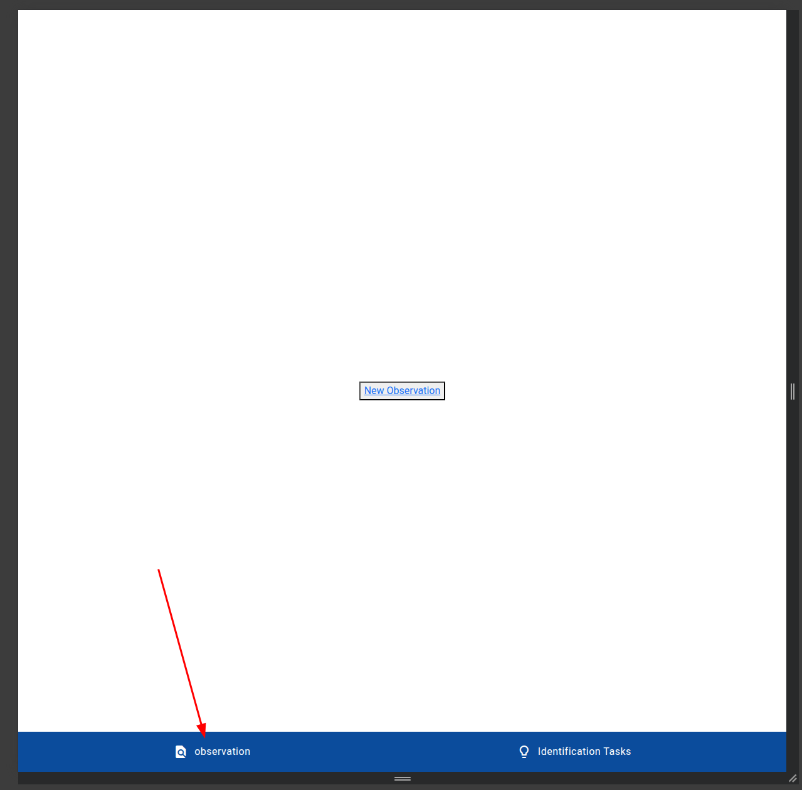
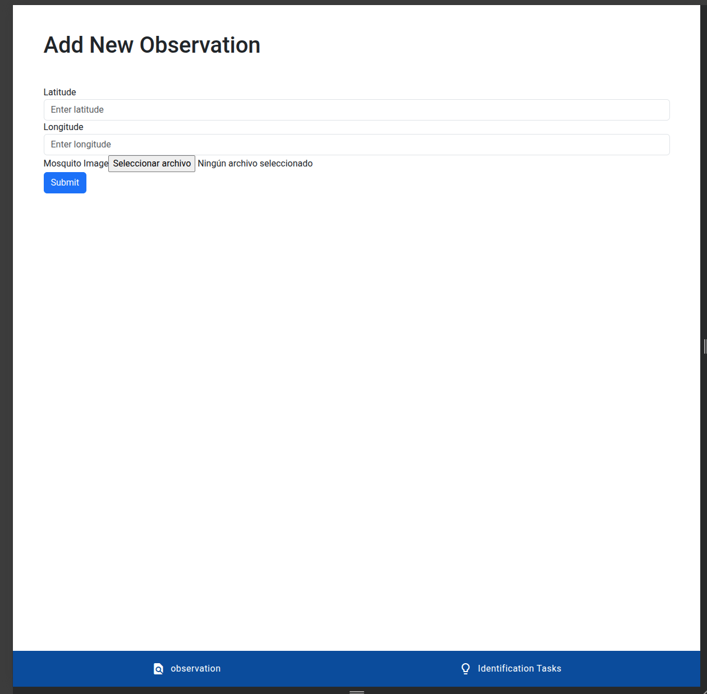
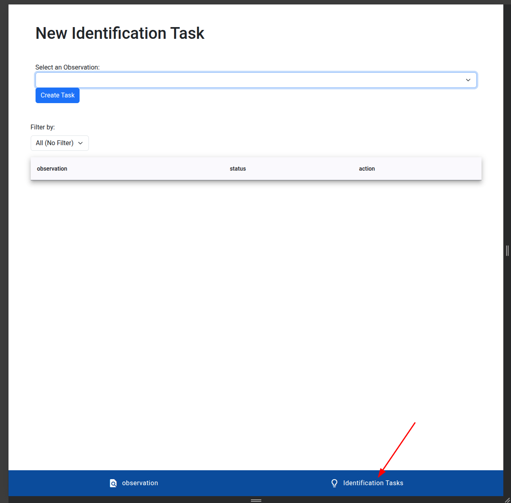
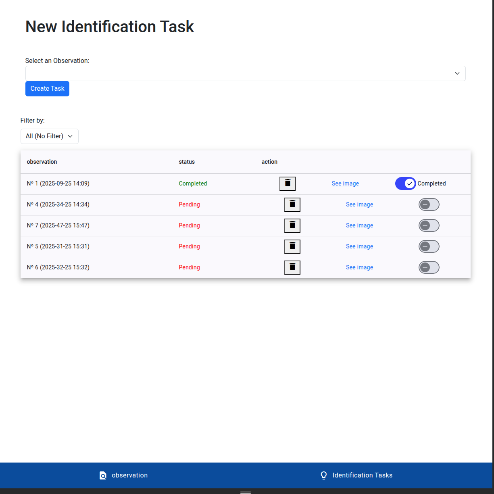

# Identification Task App

## Description

This is a web application developed with Angular on the frontend and Django REST Framework (DRF) on the backend. Its purpose is to manage identification tasks and user observations, allowing the creation, storage, and retrieval of data through a REST API.

## Technologies Used

### Frontend

- Angular (Standalone Components)
- Angular Material (For UI and notifications)
- Reactive Forms (Form management)
- RxJS

### Backend

- Django REST Framework (DRF)
- SQLite (Database)

### Docker

- App deployment

## Installation

The application is dockerized, simply run the following command in the project root:

```
docker-compose up --build
```

This will launch both the backend and frontend in Docker containers.

## Application Usage

1. Register observations





2. Once an observation is registered, in the "identification tasks" section, we must open a new identification process associated with an observation.



   1. On this screen we have:
      1. A form to select observations and open an identification process.
      2. A table where all open tasks will be displayed.
      3. A filter to view tasks based on their status.

3. In the task table, we can:
   1. Delete the task.
   2. View the image associated with the observation.
   3. Mark it as completed or not.



## Project Structure

```
identification-task-app/
├── backend-Django/  
│   ├── manage.py
│   ├── api/
│   ├── apps/
│   ├── config/
│   ├── db/           # Data persistence
│   ├── uploads/      # Storage of observation images
│   ├── static/
│   └── Dockerfile.txt
│   └── entrypoint.sh
│   └── manage.py
│   └── requirements.txt
├── frontend-Angular/mosquitoAPP  
│   ├── src/
│   │   ├── app/
│   │   ├── environments/
│   │   ├── main.ts
│   │   ├── styles.css
│   │   ├── index.html
│   │   ├── shared/
│   │   ├── services/
│   │   └── components/
│   ├── Dockerfile
│   ├── angular.json
│   ├── package.json
│   ├── tsconfig.json
│   └── README.md
├── docker-compose.yml  # Docker Configuration
└── README.md  # Main Documentation
```

## Observations

### Relationship between locations and observations

There is a OneToMany relationship between locations and observations since an observation has GPS coordinates with a precision of 10 meters, meaning there can be more than one observation with the same coordinates. Therefore, when deleting an observation, the coordinate is not removed, only when it has no associated observations.

### Images

In the frontend, I do not use the endpoint that returns the image; instead, I use the URL exposed by the server. This is done to improve performance.

### Relationship between observations and identification tasks

I consider that if an observation already has an identification process, another one cannot be opened. This is managed at the UI level.